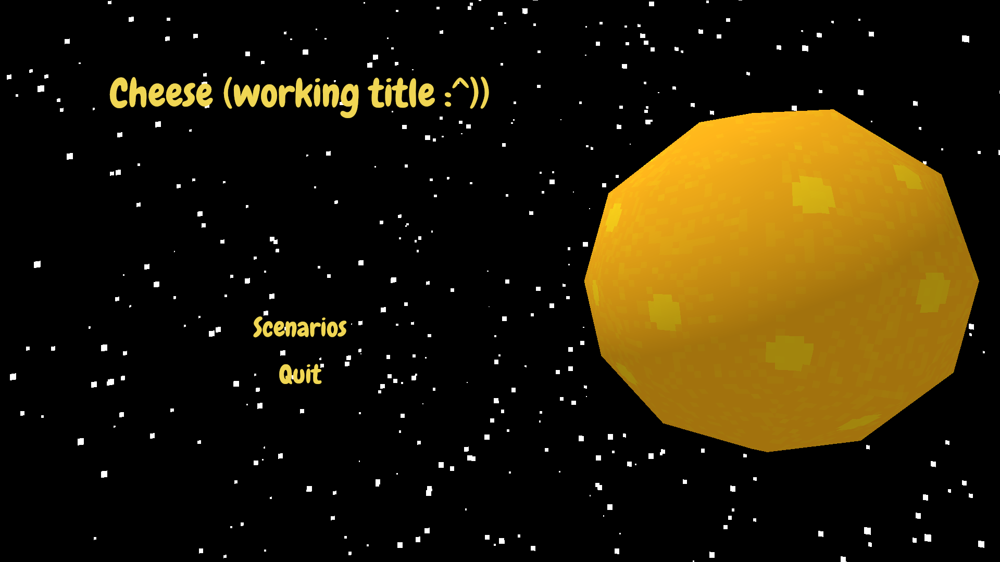
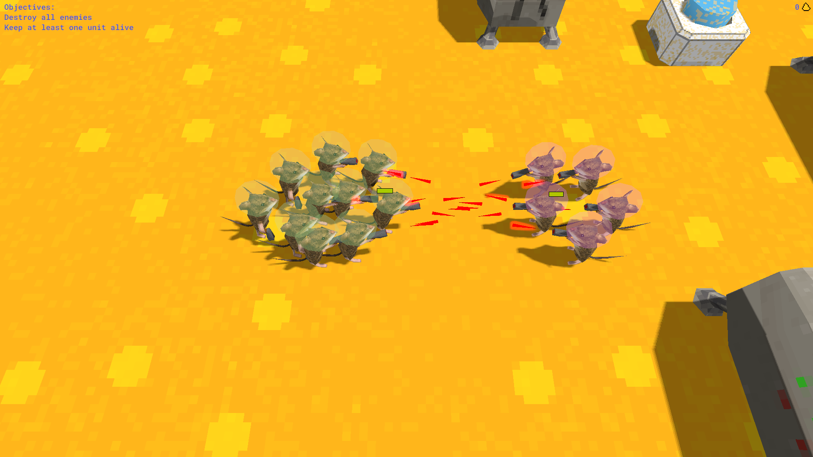

As we all know, the moon is made of cheese. Unfortunately, the cheese on the surface of the moon is a bit dry and tasteless, due to sitting out in a vacuum.  The really good cheese lies underground in vast cheese lakes. As the CEO of a hyper-capitalistic mice company, it's your job is control the flow of cheese at all costs!

Featuring:

## A titlescreen! (Very Important!)

## Cute mice!

## Combat!

## Everything explodes!

